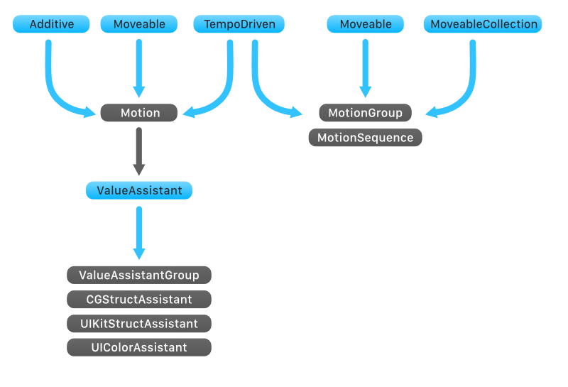
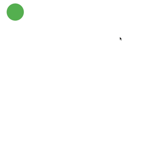
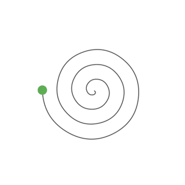
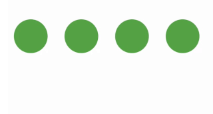

## Overview

All standard motion classes in MotionMachine conform to the `Moveable` protocol. This protocol defines the minimum ways that a motion class should operate within the MotionMachine ecosystem. For instance, each class has start, stop, pause, and resume methods, and each one must support the ability to reverse the direction of the value's movement. This enables them to work seamlessly together without knowing or caring about their specific class types. If you want to use your own custom motion classes within the MotionMachine ecosystem, simply have them adopt the `Moveable` protocol. However, the base `Motion` class offers such modularity that in most cases you can just add to or replace the components you need with your own implementation.

`Motion` and `PhysicsMotion` are the base motion classes; they take in `PropertyData` or `MotionState` objects which provide a `KeyPath` and value states and use these as instructions for how to modify the property values of an object. Each instance of `PropertyData` provides movement data that is specific to one property or discrete object. `MotionState` provides higher-level state of a whole object, and MotionMachine internally converts these states into `PropertyData` objects. While the motion classes handle interpolating values over time, the object's property values are accessed and set by `ValueAssistant` objects. MotionMachine has value assistants for several standard value types used on Apple platforms, but you can add your own custom assistants to a `Motion` to increase the types it can use.

These value updates are made as the motion moves through time. This movement is done via the `TempoProviding` protocol, which specifies how conforming classes send update "beats" to motion classes which adopt the `TempoDriven` protocol. MotionMachine comes with a few such tempo providers – `CATempo` (for iOS, visionOS, and tvOS) and `MacDisplayLinkTempo` (for macOS), which both provide tempo updates via a `CADisplayLink` for optimized CPU usage, and `TimerTempo`, which provides tempo updates via a `Timer` object. The default `TempoProviding` class assigned to all MotionMachine classes is `DisplayLinkTempo`, which uses a `CATempo` or `MacDisplayLinkTempo` class depending on the system platform being used.




## Motion

`Motion` uses Swift KeyPaths (i.e. `\UIView.frame.size.width`) to target specific properties of an object and transform their values over a period of time via an easing equation. The KeyPath's root object you supply to a `PropertyData` should be at least one level above the property value you wish to modify (i.e. a UIView if you wish to modify a property of its frame), and must be a class reference. For a `MotionState` object, the KeyPath you should supply should have a root object one level above the state object (such as a UIView if the supplied state is a CGRect for the KeyPath `\UIView.frame`). This is necessary for MotionMachine to be able to modify the original object reference.

Here's a basic example using this workhorse of MotionMachine. We've supplied the `Motion` with a single `PropertyData` object which defines a property keyPath and an ending value, along with a duration of 1 second and a Quadratic easing equation. This easing parameter defines the easing equation assigned to the `easing` property. If your `Motion` has `isReversing` set to `true`, you can also specify a separate easing equation for the reverse movement via the `reverseEasing` property. If that property is undefined, the `Motion` will use the `easing` property for both motion directions.

Notice that we're directly modifying the `x` value of the CGPoint inside the UIView's frame. MotionMachine handles these struct modifications transparently for you using value assistants. Also of note is that the `start()` method can be chained to the constructor, as can `afterDelay(amount:)` which sets a delay before the start of the motion.
```swift
let motion = Motion(target: view,
                properties: [PropertyData(keyPath: \UIView.frame.origin.x, start: 20.0, end: 200.0)],
                  duration: 1.0,
                    easing: EasingQuadratic.easeInOut()
                   ).start()
```

Passing in `PropertyData`s can be useful if you want to provide unique easing equations, durations, or other options per-property for an object, however there's a much more convenient way to animate complex objects when you don't need that kind of granular control. `Motion` has a convenience initializer where we can supply a [parameter pack](https://www.swift.org/blog/pack-iteration/) of `MotionState` objects to easily animate multiple properties by passing in representations of their start and end states. MotionMachine will take care of the rest by generating `PropertyData` objects internally for each property that changes between states. For instance in the case of a UIView's frame being animated in the example below, the `Motion` initializer will setup animations for the x, width, and height properties because those values change between the two state presentations we've passed in with the `MotionState` object.

Note that we only have an ending value for the backgroundColor `MotionState` object. If you don't provide a start parameter for a `MotionState` or a `PropertyData` object, `Motion` will use the target object's current value of the property specified in the keyPath as a starting value. Be aware that this starting value will be determined at the time of the `Motion` object's creation. 

Also of note on this `MotionState` is its KeyPath. Why is there this `[default: .black]` subscript on `backgroundColor`? That's because `backgroundColor` is an optional value on UIView. Due to [current limitations](https://forums.swift.org/t/crash-during-optional-key-path-access-what-is-going-on/69141) with Swift's handling of optional values when appending KeyPaths, MotionMachine requires that all path object optionals – even segments in the middle of the key path – use this special subscript format to specify a default value so that it can properly utilize the KeyPath to write values to the target object.
```swift
let frameState = MotionState(keyPath: \UIView.frame, start: CGRect(x: 20.0, y: 50.0, width: 50.0, height: 50.0), end: CGRect(x: 50.0, y: 50.0, width: 200.0, height: 200.0))
let colorState = MotionState(keyPath: \UIView.backgroundColor[default: .black], end: .systemBlue)

// The `states` parameter here is a parameter pack of `MotionState` objects which have unique generic types. Pass them in as you would a normal variadic parameter. 
let motion = Motion(target: view,
                    states: frameState, colorState,
                  duration: 1.0,
                    easing: EasingQuadratic.easeInOut()
                   ).start()
```

To create more complex movements you can set other behaviors in the `options:` init parameter by using one or more `MotionOptions` values. For example, you can set a `Motion` to repeat its motion cycle, to reverse the direction of value movements, or both at the same time. A *motion cycle* is one cycle of a `Motion`'s specified value movements. For a normal motion, that will be a movement from the starting values to the ending values. For a reversing motion, a motion cycle comprises both the forward movement and the reverse movement. Thus, a `Motion` that is both reversing and repeating will repeat its motion after moving forwards and then returning back to its starting values.

Note that if you don't set a value for `repeatCycles`, the `Motion` will repeat infinitely.
```swift
let motion = Motion(target: view,
                properties: [PropertyData(keyPath: \UIView.frame.origin.x, end: 200.0)],
                  duration: 1.0,
                    easing: EasingQuadratic.easeInOut(),
                   options: [.reverses, .repeats])
motion.repeatCycles = 1
motion.start()
```

`Motion` also supports a powerful feature called additive animation, which you can set by adding `MotionOptions`'s `additive` option in the `options` initializer parameter. Additive animation allows multiple motions to produce a compound effect, creating smooth transitions and blends between different ending value targets. 

By default, each `Motion` will apply a strong influence on the movement of a property towards its ending value. Multiple `Motion` objects with the same duration and moving the same object property to different ending values will be in conflict, and the "winning" value will be the last `Motion` to start its movement. If the durations or starting times are different, a transition between the values will occur, as can be seen in the below animation where a new `Motion` is added on every tap. This transition occurs because the most recent additive `Motion` will assign the ending value of the last additive `Motion` that animated the same property value as its starting position, creating a blend as two or more `Motion`s animate the property values in parallel.

Please note that all `Motion` objects which simultaneously interpolate the same property value must have the `additive` option set in order to participate in additive animation and produce expected results.



In this first example, two additive `Motion` objects are transforming the same view's frame. The first `Motion` has an ending `x` value of 20.0, while the second `Motion` has an ending `x` value of 100.0. Because it starts last, it wins out and 100.0 becomes the ending `x` value for the view's frame when both `Motion` objects have completed.
```swift
let frameState = MotionState(keyPath: \UIView.frame, end: CGRect(x: 20.0, y: 200, width: 40, height: 40))
let frame2State = MotionState(keyPath: \UIView.frame, end: CGRect(x: 100.0, y: 200, width: 40, height: 40))

self.motion = Motion(target: circle, states: frameState, duration: 1.5, easing: EasingQuadratic.easeInOut(), options: [.additive])
self.motion2 = Motion(target: circle, states: frame2State, duration: 1.5, easing: EasingQuadratic.easeInOut(), options: [.additive])

motion?.start()
motion2?.start()
```

If you wish to create additive motions that apply weighted value updates, you can adjust the `additiveWeighting` property. Setting values less than 1.0 to the most recently started `Motion` will create composite, additive movements that are blends of each `Motion` object's ending values. In this second example we are adding an additive weighting of 0.5 to the second `Motion`. What this will do is put the ending value halfway between the two `Motion`s values of 0.0 and 80.0. So instead of the final `x` value of the view's frame being 80.0, it ends up at 40.0.
```swift
let frameState = MotionState(keyPath: \UIView.frame, end: CGRect(x: 0.0, y: 200, width: 40, height: 40))
let frame2State = MotionState(keyPath: \UIView.frame, end: CGRect(x: 80.0, y: 200, width: 40, height: 40))

self.motion = Motion(target: circle, states: frameState, duration: 1.5, easing: EasingQuadratic.easeInOut(), options: [.additive])
self.motion2 = Motion(target: circle, states: frame2State, duration: 1.5, easing: EasingQuadratic.easeInOut(), options: [.additive])
motion2?.additiveWeighting = 0.5

motion?.start()
motion2?.start()
```

#### Easing Equations

MotionMachine includes all the standard Robert Penner [easing equations](https://easings.net) for use with `Motion`. All of the easing types have `easeIn()`, `easeOut()`, and `easeInOut()` methods, except for `EasingLinear` which only has `easeNone()`. Of course you can also use your own custom easing equations with `Motion` by conforming to the `EasingUpdateClosure` type.

* EasingLinear (the default equation used if none is specified)
* EasingCubic
* EasingQuadratic
* EasingQuartic
* EasingQuintic
* EasingCubic
* EasingExpo
* EasingSine
* EasingCircular
* EasingElastic
* EasingBounce
* EasingBack

## PhysicsMotion

`PhysicsMotion` uses a keyPath (i.e. `\UIView.frame.origin.x`) to target specific properties of an object and transform their values, using a physics system to update values with decaying velocity. The physics system conforms to the `PhysicsSolving` protocol, and though `PhysicsMotion` uses the (very basic) `PhysicsSystem` class by default you can replace it with your own custom `PhysicsSolving` system.

Here's a simple example. We pass in an initial `velocity`, along with a `friction` value which reduces the velocity over time. The `friction` value should be within a range of 0.0 to 1.0, but there is no limitation on the `velocity` value due to the differing magnitudes of property values you may want to alter. Note that the only necessary `PropertyData` parameter is `keyPath`; we can't guarantee a certain ending value, so the physics system will determine the value's resting place. (You can still specify a `start` value from where the physics simulation should start from though, and as we'll see next you can also use the `start` and `end` parameters as collision "walls".) Likewise, there is also no duration property because the total movement time is determined by the `velocity` and `friction` interaction.
```swift
let motion = PhysicsMotion(target: view,
                       properties: [PropertyData(keyPath: \UIView.frame.origin.y)],
                         velocity: 600.0,
                         friction: 0.8
                          ).start()
```

`PhysicsMotion` also supports simple collision handling. In this example we're going to turn on collision detection and add a `restitution` value. This value enables the object to collide and "bounce" off a `PropertyData`'s `start` and `end` values. The `restitution` value determines the elasticity of a colliding object, which in effect determines how much velocity the property values retain after colliding with an edge. A `restitution` value of 0.0 results in no bouncing at all, while a value of 1.0 results in no energy being lost in the collision.

Note that in this example we're passing in a `PhysicsConfiguration` object. It's just a slightly nicer way of encapsulating the engine parameters when passing them to the `PhysicsMotion` initializer.
```swift
let config = PhysicsConfiguration(velocity: 300, friction: 0.72, restitution: 0.5, useCollisionDetection: true)
motion = PhysicsMotion(target: view,
                   properties: [PropertyData("frame.origin.x", end: 300)],
                configuration: config)
.start()
```

Although `PhysicsMotion` uses a physics simulation instead of specifying discrete ending values, we can still apply `repeats` and `reverses` options, and `PhysicsMotion` has the same chainable `repeats()` method. These options will take effect once a motion's velocity reduces to zero. Repeating and reversing act in the same way as `Motion` and interacts with `MoveableCollection` classes as you would expect.
```swift
let motion = PhysicsMotion(target: view,
                       properties: [PropertyData(keyPath: \UIView.frame.origin.x)],
                         velocity: 150.0,
                         friction: 0.75,
                          options: [.reverses])
.repeats(1).start()
```

Like the `Motion` class, `PhysicsMotion` also supports a powerful feature called additive animation, which you can set by adding `MotionOptions`'s `additive` option in the `options` initializer parameter. Additive animation allows multiple motions to produce a compound effect, creating smooth transitions and blends between different ending value targets. Please see `Motion`'s additive discussion above for more details and implementation examples. `PhysicsMotion`'s additive mode functions the same, and can be used in conjunction with additive `Motion` objects as well.

## PathMotion

`PathMotion` transforms a `CGPoint` along a `CGPath` object over a period of time via an easing equation. Unlike a normal `Motion` class it does not accept `PropertyData` objects; due to the complex nature of paths, `PathMotion` only accepts a `PathState` object, an easing equation, and optional starting and end points to determine what area of the path to animate along. The resulting transformed `CGPoint` value is provided via its status closure methods. Thus a typical use would be to listen to the `updated({ (motion, currentPoint) })` closure and use the provided `currentPoint` parameter to update your own values such as a view's center point. Though it is limited to transforming `CGPoint` values, and it does not support additive motion at this time, in all other respects `PathMotion` integrates with the `Moveable` ecosystem just like the other motion types, greatly expanding the types of complex animations MotionMachine can create. 



Here's a basic example. We've supplied the `PathMotion` with a basic CGPath via a `PathState` object, an easing equation, and we've told it to reverse back to the beginning once it travels to the end. Notice though how we've defined a `startPosition` and `endPosition`. This tells the `PathMotion` it should start the animation at a point 10% from the beginning of the path and end the animation at a point 80% along the path's length. If you leave these parameters out it will travel the full distance.
```swift
let path = UIBezierPath(rect: CGRect(x: 0, y: 0, width: 100, height: 100))
motion = PathMotion(path: path.cgPath,
                duration: 1.0,
           startPosition: 0.1,
             endPosition: 0.8,
                  easing: EasingQuadratic.easeInOut(),
                 options: [.reverses])
motion.start()
```

In this example note that we've added an `edgeBehavior` parameter to the `PathMotion` initializer. There are two types of edge behaviors – `stopAtEdges` (the default), which simply stops motion once the animated point gets to either specified edge point, and `contiguousEdges`, which tells the `PathMotion` that the path's starting and ending edges should be treated as connected, contiguous points. If the animated point travels beyond the path's edge, as can happen with some easing equation classes like `EasingElastic` and `EasingBack`, the motion will continue in the current direction at the beginning of the other edge. This behavior type is useful with closed paths like polygonal shapes to create a seamless animation.
```swift
let path = UIBezierPath(rect: CGRect(x: 0, y: 0, width: 100, height: 100))
motion = PathMotion(path: path.cgPath,
                duration: 1.0,
                  easing: EasingElastic.easeInOut(),
            edgeBehavior: .contiguousEdges)
.repeats()  
.start()
```

The `startPosition` and `endPosition` values can also be flipped. Doing so will make the point travel along the path from the end of the path towards the beginning in its forward motion. In this example, the motion point will start at 80% along the path and travel "backwards" to 20%. If you added a `reverses` option, then at the end of the motion it would reverse along the path back to 80%.
```swift
let path = UIBezierPath(rect: CGRect(x: 0, y: 0, width: 100, height: 100))
motion = PathMotion(path: path.cgPath,
                duration: 1.0,
           startPosition: 0.8,
             endPosition: 0.2,
                  easing: EasingQuadratic.easeInOut())
motion.start()
```

> [!IMPORTANT]
> Note that because it is mathematically complex to find all points on a CGPath, large, complex paths can present performance challenges for `PathMotion` to animate along. Fortunately, `PathMotion` comes with a performance mode. When this mode is activated, `PathState` generates a lookup table which it uses to find points on the path in O(n) time. While this increases setup time, it significantly improves performance while the motion is running, for instance from 10% down to 1% CPU usage. To use performance mode, call the async method `setupPerformanceMode()` before starting the `PathMotion`, as shown in the below example. This method will run the lookup table generation code on a background queue and return when complete. For most reasonably large paths this should take under a second.
```swift
Task {
    await motion?.setupPerformanceMode()
    motion?.start()
}
```

## PathPhysicsMotion

`PathPhysicsMotion` transforms a `CGPoint` along a `CGPath` object using a physics system to update the point's position with decaying velocity. Like `PathMotion` it does not accept `PropertyData` objects; due to the complex nature of paths, `PathPhysicsMotion` only accepts a `PathState` object and optional starting and end points to determine what area of the path to animate along. The resulting transformed `CGPoint` value is provided via its status closure methods. Thus a typical use would be to listen to the `updated({ (motion, currentPoint) })` closure and use the provided `currentPoint` parameter to update your own values, such as a view's center point. Though it is limited to transforming `CGPoint` values, and it does not support `additive` motion at this time, in all other respects `PathPhysicsMotion` integrates with the `Moveable` ecosystem just like the other motion types, greatly expanding the types of complex animations MotionMachine can create. 

Here's a basic example. We've supplied the `PathPhysicsMotion` with a basic CGPath via a `PathState` object, an easing equation, and we've told it to reverse back to the beginning once it travels to the end. Notice though how we've defined a `startPosition` and `endPosition`. This tells the `PathPhysicsMotion` it should start the animation at a point 10% from the beginning of the path and end the animation at a point 80% along the path's length. If you leave these parameters out it will have the full length of the path to travel along.
```swift
let path = UIBezierPath(arcCenter: CGPoint(x: 20, y: 20), radius: 100, startAngle: 0.087, endAngle: 1.66, clockwise: true)
let config = PhysicsConfiguration(velocity: 500, friction: 0.4)
motion = PathPhysicsMotion(path: path.cgPath, 
                  configuration: config,
                  startPosition: 0.1, 
                    endPosition: 0.8)
motion.start()
```

In this second example we're going to turn on collision detection and add a `restitution` value. Technically, collisions are turned on any time the `stopAtEdges` edge behavior is chosen, but adding a `restitution` value will cause a change in the motion. This value enables the object to collide and "bounce" off the starting and ending points when a point reaches them. The `restitution` value determines the elasticity of the object, which in effect determines how much velocity the object retains after colliding with an edge. A `restitution` value of 0.0 (the default if no value is provided) results in no bouncing at all, while a value of 1.0 results in no energy being lost in the collision. By default the collision points are at the start and end of the path, but if you specify your own start and end points those will be used instead.
```swift
let path = UIBezierPath(arcCenter: CGPoint(x: 20, y: 20), radius: 100, startAngle: 0.087, endAngle: 1.66, clockwise: true)
let config = PhysicsConfiguration(velocity: 600, friction: 0.4, restitution: 0.8)
motion = PathPhysicsMotion(path: path.cgPath, 
                  configuration: config)
motion.start()
```

Although `PathPhysicsMotion` uses a physics simulation instead of specifying discrete ending values, we can still apply `repeats` and `reverses` options. These options will take effect once a motion's velocity reduces to zero. Repeating and reversing act in the same way as `Motion` and interacts with `MoveableCollection` classes as you would expect.
```swift
let path = UIBezierPath(arcCenter: CGPoint(x: 20, y: 20), radius: 100, startAngle: 0.087, endAngle: 1.66, clockwise: true)
let config = PhysicsConfiguration(velocity: 500, friction: 0.4)
motion = PathPhysicsMotion(path: path.cgPath, 
                  configuration: config)
.reverses()
.repeats(1)
.start()
```

The `startPosition` and `endPosition` values can also be flipped. Doing so will make the point travel along the path from the end of the path towards the beginning in its forward motion. Be aware that if you do this the velocity should also be a negative value in order for the point to travel in the correct direction. In this example, the motion point will start at 80% along the path and travel "backwards" to 20%.
```swift
let path = UIBezierPath(arcCenter: CGPoint(x: 20, y: 20), radius: 100, startAngle: 0.087, endAngle: 1.66, clockwise: true)
let config = PhysicsConfiguration(velocity: -600, friction: 0.4, restitution: 0.8)
motion = PathPhysicsMotion(path: path.cgPath, 
                  configuration: config,
                  startPosition: 0.8, 
                    endPosition: 0.2)
motion.start()
```

> [!IMPORTANT]
> Note that because it is mathematically complex to find all points on a CGPath, large, complex paths can present performance challenges for `PathPhysicsMotion` to animate along. Fortunately, `PathPhysicsMotion` comes with a performance mode. When this mode is activated, the `PathState` object generates a lookup table which it uses to find points on the path in O(n) time. While this increases setup time, it significantly improves performance while the motion is running, for instance from 10% down to 1% CPU usage. To use performance mode, call the async method `setupPerformanceMode()` before starting the `PathPhysicsMotion`, as shown in the below example. This method will run the lookup table generation code on a background queue and return when complete. For most reasonably large paths this should take under a second.
```swift
Task {
    await motion?.setupPerformanceMode()
    motion?.start()
}
```

## MotionGroup

`MotionGroup` is a `MoveableCollection` class that manages a group of `Moveable` objects, controlling their movements in parallel. It's handy for controlling and synchronizing multiple `Moveable` objects. A single `MotionGroup` could hold `Motion`, `PhysicsMotion`, and `PathMotion` objects, and even other `MoveableCollection` objects. As with all `Moveable` classes, you can `pause()` and `resume()` a `MotionGroup`, which pauses and resumes all of its child motions simultaneously.

This example adds two `Motion` objects and starts them.
```swift
let motion1 = Motion(view1, property: PropertyData(keyPath: \UIView.frame.origin.y, end: 200.0), duration: 1.0, easing: EasingQuadratic.easeInOut())
let motion2 = Motion(view2, property: PropertyData(keyPath: \UIView.frame.origin.y, end: 200.0), duration: 1.0, easing: EasingQuadratic.easeInOut())

let group = MotionGroup(motions: [motion1, motion2]).start()
```


If you don't need to do anything individually with the child objects of a `MotionGroup`, you can just instantiate them directly; the `MotionGroup` will keep a reference to all objects it manages. In this example we're creating `Motion` objects within the `add(motion:)` method, which is chainable with the constructor.

Note that we've added a `reverses(syncsChildMotions:)` method to the init chain, which tells the `MotionGroup` to set all of its child motions to reverse. Passing `true` to the `syncsChildMotions:` parameter specifies that the `MotionGroup` should synchronize its child motions before reversing their movement direction. That is, the `Motion` with the `duration` of 1.0 will wait until the `Motion` with a 1.2 second duration has finished its forward movement. Only then will both reverse directions and move back to their starting values.
```swift
let group = MotionGroup()
.add(Motion(target: square1,
        properties: [PropertyData(keyPath: \UIView.frame.origin.x, end: 200.0)],
          duration: 1.0,
            easing: EasingQuadratic.easeInOut()))
.add(Motion(target: square2,
        properties: [PropertyData(keyPath: \UIView.frame.size.width, end: 60.0)],
          duration: 1.2,
            easing: EasingQuadratic.easeInOut()))
.reverses(syncsChildMotions: true)
.start()

```


`Motion` objects have just been used so far to populate each `MotionGroup`, but any `Moveable` class can be added. In this example we're adding a `Motion` and another `MotionGroup` to a different `MotionGroup` which is set to reverse. Reversing and repeating options work as expected with child groups. You can build up very complex motions by nesting groups like this, as many levels deep as you need.
```swift
let subgroup = MotionGroup()
.add(Motion(target: square1,
        properties: [PropertyData(keyPath: \UIView.frame.origin.x, end: 200.0)],
          duration: 1.0,
            easing: EasingQuadratic.easeInOut()))
.add(Motion(target: square2,
        properties: [PropertyData(keyPath: \UIView.frame.origin.y, end: 60.0)],
          duration: 1.2,
            easing: EasingQuadratic.easeInOut()))

let group2 = MotionGroup(options: [.reverses])
.add(subgroup)
.add(Motion(target: square2,
        properties: [PropertyData(keyPath: \UIView.frame.size.width, end: 150.0)],
          duration: 2.0,
            easing: EasingSine.easeInOut()))
.start()
```

## MotionSequence

`MotionSequence` is a `MoveableCollection` class which moves a collection of `Moveable` objects in sequential order. `MotionSequence` provides a powerful and easy way of chaining together individual motions to create complex animations. A single `MotionSequence` could hold `Motion`, `PhysicsMotion`, and `PathMotion` objects, and even other `MoveableCollection` objects. The order of its `steps` Array property is the order in which the sequence steps are triggered.

A simple example that adds two `Motion` objects. The `start()` method chained to the `MotionSequence` constructor will start the sequence, with motion1 starting its movement first, and then motion2 starting after the first `Motion` completes.
```swift
let motion1 = Motion(view, property: PropertyData(keyPath: \UIView.frame.origin.x, end: 200.0), duration: 1.0, easing: EasingQuadratic.easeInOut())
let motion2 = Motion(view, property: PropertyData(keyPath: \UIView.frame.origin.y, end: 300.0), duration: 1.0, easing: EasingQuadratic.easeInOut())

let sequence = MotionSequence(steps: [motion1, motion2]).start()
```

As with `MotionGroup`, if you don't need to do anything individually the child objects of a `MotionSequence`, you can instantiate them directly; the `MotionSequence` will keep a reference to all objects it manages. In this example we're creating `Motion` objects with the `add(motion:)` method, which is chainable with the constructor. These motions will be triggered in the order they are added.
```swift
let sequence = MotionSequence(options: [.reverses])
.add(Motion(target: square,
        properties: [PropertyData(keyPath: \UIView.frame.origin.x, end: 200.0)],
          duration: 1.0,
            easing: EasingQuadratic.easeInOut()))
.add(Motion(target: square,
        properties: [PropertyData(keyPath: \UIView.frame.size.width, end: 60.0)],
          duration: 1.2,
            easing: EasingQuadratic.easeInOut()))
.start()
```

One of the most powerful aspects of `MotionSequence` is the ability for it to coordinate the movements of its child motions when it is reversing. This is set with the `reversingMode` property, or by passing a `CollectionReversingMode` value into the chainable `.reverses(_:)` method as shown in the example below. When in `sequential` mode, all of its sequence steps will move in a forward direction when the `MotionSequence` is reversing direction. That is, when reversing the `MotionSequence` will signal each of its `Moveable` steps to move normally, just in a reversed order. This mode is useful if for example you have a series of lights that should blink on and off in sequential order, and the only thing that should change is the order in which they blink. But the `contiguous` mode is where things get interesting. When in this mode and the `MotionSequence` is moving in the reverse direction, the values of each sequence step will move in reverse, and in reverse order, thus giving the effect that the whole sequence is fluidly moving in reverse. This is a really powerful way of making many separate animations appear to be a single animation when reversing.

In the below example, four circles are set up to animate their topAnchor constraints and then reverse. Each of these `MotionGroup` objects is then added to a `MotionSequence` which also reverses, with its `reversingMode` set to `sequential` in order to have each circle motion play and reverse independently and serially.

```swift
// create a reversing MotionSequence with its reversingMode set to sequential to have each child motion play independently.
self.sequence = MotionSequence().reverses(.sequential)

// set up motions for each circle and add them to the MotionSequence
for x in 0..<4 {
    // motion to animate a topAnchor constraint down
    let down = Motion(target: constraints["y\(x)"],
                      properties: [PropertyData(keyPath: \NSLayoutConstraint.constant, end: 60.0)],
                      duration: 0.4,
                      easing: EasingQuartic.easeInOut())

    // motion to change background color of circle
    let color = Motion(target: circles[x],
                       states: MotionState(keyPath: \UIView.backgroundColor[default: .black], end: .systemBlue),
                       duration: 0.3,
                       easing: EasingQuadratic.easeInOut())

    // wrap the Motions in a MotionGroup and set it to reverse
    let group = MotionGroup(motions: [down, color]).reverses(syncsChildMotions: true)

    // add group to the MotionSequence
    sequence.add(group)
}
sequence.start()
```




Here is the same `MotionSequence` with its `reversingMode` set to `contiguous`. You can see how each child motion waits after its forward motion, and then plays their reverse motion in reverse sequence.

```swift

// create a reversing MotionSequence with its reversingMode set to contiguous to create a single fluid motion from its child motions
sequence = MotionSequence().reverses(.contiguous)
```


## Status Updates

MotionMachine has a full compliment of status callback closures. They are chainable with the constructor. All of the following closures are available with the standard `Moveable` classes.

```swift
let motion = Motion(square, duration: 2.0, property: PropertyData(keyPath: \UIView.frame.origin.x, end: 200.0))
.started({ (motion) in
    // Called when a motion starts.
})
.stopped({ (motion) in
    // Called when the stop() method is called on a Moveable object.
})
.updated({ (motion) in
    // Called when the update(withTimeInterval:) method is called while a Moveable object is currently moving.
})
.reversed({ (motion) in
    // Called when the Moveable object reverses its movement direction.
})
.repeated({ (motion) in
    // Called when the Moveable object repeats its motion cycle.
})
.paused({ (motion) in
    // Called when the pause() method is called on a Moveable object.
})
.resumed({ (motion) in
    // Called when the resume() method is called on a Moveable object.
})
.completed({ (motion) in
    // Called when a Moveable object's motion operation has fully completed.
})
```

## Supported MotionState Types

`Motion` and `PhysicsMotion` use classes that conform to the `ValueAssistant` protocol to retrieve and update property values. Several assistants for common system framework object types are included in MotionMachine. While MotionMachine accepts any valid KeyPath that ends in a supported numeric value (and these are handled by `NumericAssistant`), these assistants give `Motion` and `PhysicsMotion` the ability to use system types like UIColor and CGRect with `MotionState` objects by generating a `PropertyData` for each changed property of the object type. You can also add your own custom assistants to extend the types that can be used as motion states.

The following `ValueAssistant` classes are included in MotionMachine and available on supported platforms:

*NumericAssistant*
* BinaryFloatingPoint types
* BinaryInteger types
* NSNumber

*CGStructAssistant*
* CGPoint
* CGSize
* CGRect
* CGVector
* CGAffineTransform
* CATransform3D

*CGColorAssistant*
* CGColor

*UIColorAssistant*
* UIColor

*CIColorAssistant*
* CIColor

*UIKitStructAssistant*
* UIEdgeInsets
* UIOffset

*SIMDAssistant*
* SIMD2
* SIMD3
* SIMD4
* SIMD8
* SIMD16
* SIMD32
* SIMD64
